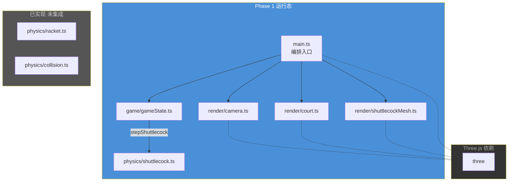
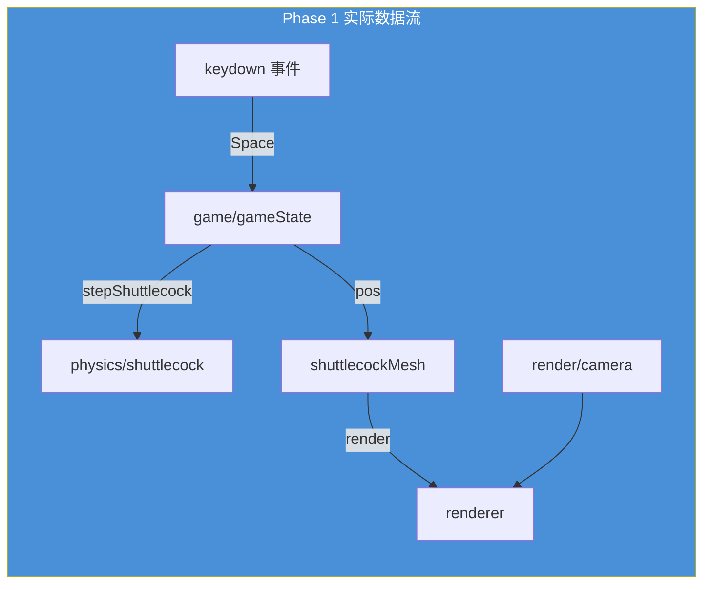
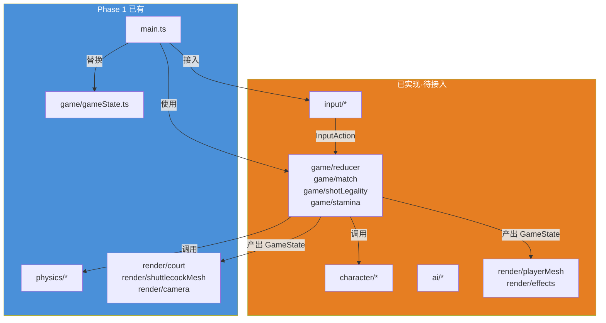
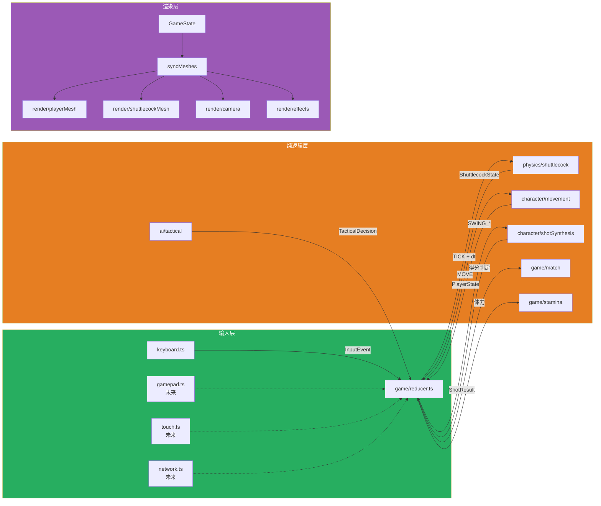
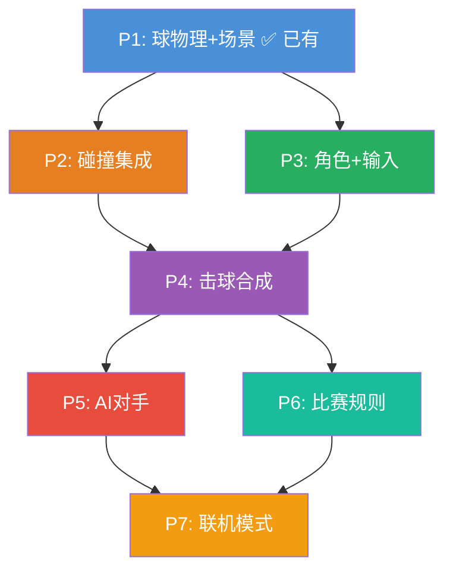

# badminton-web 架构

> 本文档分两层：**当前现状**（真实运行的代码）和 **规划蓝图**（已设计/实现但尚未接入的模块）。
> 设计理念见 [design.md](design.md)。

---

## 当前现状

Phase 1 实际运行的代码模块。只有以下代码被 `main.ts` 直接或间接使用。

### 运行态模块依赖图



### 模块接口（现状）

#### `physics/shuttlecock.ts`

```typescript
type ShuttlecockState = { pos, vel, spin: [3]number }
type ShuttlecockConfig = { mass, crossSection, magnusCoef: number }

function stepShuttlecock(state, dt, cfg?, subSteps?): ShuttlecockState
function launchShuttlecock(origin, speed, angleDeg, headingDeg, spin?): ShuttlecockState
```

✅ **已测试**：`shuttlecock.test.ts` 包含数值稳定性测试。

#### `game/gameState.ts`

```typescript
type GamePhase = 'idle' | 'playing'
type GameState = {
  phase: GamePhase
  shuttle: ShuttlecockState | null
  readonly players: [null, null]   // Phase 2 扩展预留
}

function createInitialState(): GameState
function serveShuttle(): ShuttlecockState
function stepGame(state, dt): GameState   // 物理步进 + 落地检测
```

**当前实现**：ad-hoc 状态变更，直接赋值而非 reducer。发球参数硬编码。

#### `render/camera.ts`

```typescript
function createGameCamera(): THREE.PerspectiveCamera
function updateCamera(camera, target: THREE.Vector3): void
```

← **已从 `game/` 移入**，消除分层违规。

#### `render/court.ts`

```typescript
function createCourt(scene: THREE.Scene): void    // 球场 mesh + 网 + 支柱
```

#### `render/shuttlecockMesh.ts`

```typescript
function createShuttlecockMesh(): THREE.Group      // 球头(半球) + 裙(锥体)
```

#### `main.ts` — 编排入口

@entry 负责：场景组装 → 灯光 → 游戏循环(物理+同步+相机+渲染) → 键盘事件 → resize。

当前职责过载，未使用 `input/` 抽象层。

---

### 现状数据流



**关键观察**：Phase 1 的数据流是"直筒式"，没有集中归约器，输入直接修改全局状态。

### 已知架构债务

| # | 问题 | 位置 | 影响 |
|---|------|------|------|
| 1 | `game/` 旧 `GameState` 与新 `game/types.ts` 共存 | `gameState.ts` vs `game/types.ts` | P2 需统一 |
| 2 | `main.ts` 直接处理键盘事件 | `main.ts:56-63` | 阻塞 input 抽象层集成 |
| 3 | `physics/racket.ts`、`collision.ts` 无人调用 | 物理模块 | P2 集成前为孤儿代码 |
| 4 | 发球参数硬编码 | `gameState.ts:27-30` | P4 击球合成需重构 |
| 5 | `main.ts` 同步 Mesh + 相机 + render 混在一起 | `main.ts:68-97` | 阻碍渲染独立演化 |

---

## 规划蓝图

以下模块**已实现但尚未接入运行态**，按 Phase 顺序集成。

### 总览



### 模块接口（蓝图）

#### `input/types.ts` — 输入抽象

```typescript
type InputAction =
  | { type: 'SERVE' }
  | { type: 'MOVE'; dir: MoveDirection }
  | { type: 'STOP_MOVE' }
  | { type: 'SWING_START' }
  | { type: 'SWING_CHARGE'; power: number; elapsed: number }
  | { type: 'SWING_RELEASE' }
  | { type: 'AIM'; horizontal: number; vertical: number }
  | { type: 'PAUSE' }
  | { type: 'RESET' }

type InputSource = 'keyboard' | 'gamepad' | 'touch' | 'network'
interface InputEvent { action, source, timestamp, playerIndex }
interface InputAdapter { connect(listener): void; disconnect(): void }
```

✅ 纯 JSON 可序列化，联机模式可直接传输。

#### `input/keyboard.ts` — 键盘适配器

```typescript
type KeyMapping = { moveUp, moveDown, moveLeft, moveRight, serve, swing, pause: string }
function createKeyboardAdapter(playerIndex?, keymap?): InputAdapter
```

✅ 含轮询循环（60fps MOVE 事件）、WASD 方向归一化、SWING 蓄力/释放。

#### `character/types.ts` — 角色状态

```typescript
type Gait = 'idle' | 'walk' | 'sprint'
type MovementState = { targetDir, currentVel, gait, readiness: number }
type PlayerState = {
  pos: [3]number; facing: number; movement: MovementState
  racket: RacketState; stamina: number; maxStamina: number
  isCharging: boolean; chargeStartTime: number
  lastSwingTime: number; side: 0 | 1
}
```

#### `character/movement.ts` — 步法惯性系统

```typescript
type MovementConfig = { maxSpeed, acceleration, deceleration, turnPenalty, sprintThreshold }
function updateMovement(player, dt, cfg?): PlayerState
```

✅ 加速度/减速度模型、急转惩罚（角度 > 45° 减速）、到位度计算。已由 `game/reducer.ts` 调用（但 reducer 未接入主循环）。

#### `character/shotSynthesis.ts` — 击球合成

```typescript
type ShotType = 'SMASH' | 'DROP' | 'CLEAR' | 'DRIVE' | 'NET_DROP' | 'LIFT'
type ShotIntent = { type, power, target, spin? }
type ShotResult = { type, collision: CollisionResult, timing: TimingWindow, staminaCost }

function getAvailableShots(player, shuttle): AvailableShot[]
function synthesizeShot(intent, player, shuttle, timing): ShotResult
```

✅ 6 种球路 + 高度/距离条件判定 + 质量倍率调节。

#### `character/timing.ts` — 击球时机窗口

```typescript
type TimingWindow = { open, close: number; quality: 'perfect'|'good'|'late'|'miss' }
function computeTimingWindow(player, shuttle, cfg?): TimingWindow | null
```

✅ 基于来球速度计算最佳击球区间，分 4 档品质。

#### `ai/types.ts` — AI 决策类型

```typescript
type AIDifficulty = 'easy' | 'medium' | 'hard'
type AIConfig = { difficulty, reactionDelay, accuracy, aggressiveness, errorRate }
type TacticalDecision = { moveTarget, shotType, power, target, risk }
```

✅ 三档预设（easy/medium/hard）、难度参数差异化。

#### `ai/tactical.ts` — AI 战术选择

```typescript
function decideTactical(aiPlayer, opponent, shuttle, config): TacticalDecision
```

✅ 是否到位的判定 → 选球路 → 选落点 → 选力量，含随机扰动。

#### `ai/prediction.ts` — 对手回球预估

```typescript
type OpponentProfile = { preferredShots, weakSide, avgReactionTime }
function estimateReturnZone(opponent, profile): [3]number
```

#### `ai/difficulty.ts` — 难度参数调节

```typescript
function applyDifficulty(decision, config): TacticalDecision   // 注入失误/延时
```

#### `game/types.ts` — 扩展游戏状态

```typescript
type GamePhase = 'idle' | 'playing' | 'point_scored' | 'set_end' | 'match_end'
type MatchState = { server, currentSet, sets, points, isDeuce, serviceSide }
type GameState = {
  phase: GamePhase
  shuttle: ShuttlecockState | null
  players: [PlayerState | null, PlayerState | null]
  match: MatchState | null
  currentPlayer: 0 | 1
  elapsed: number
}
```

#### `game/reducer.ts` — 集中归约器

```typescript
type GameAction = InputAction | { type: 'TICK'; dt: number } | { type: 'RESET' } | { type: 'SET_PLAYERS' }
function gameReducer(state: GameState, action: GameAction): GameState
```

✅ **唯一状态变更入口**。处理 SERVE/MOVE/STOP_MOVE/TICK/RESET。TICK 内调用 `updateMovement`。**尚未被 main.ts 使用**。

#### `game/match.ts` — BWF 计分规则

```typescript
function checkPoint(state: GameState): GameState       // 得分判定
function handleSetEnd(match: MatchState): MatchState    // 局结算
```

✅ 三局两胜 21 分制、deuce（先到 30 分封顶）、发球权切换。

#### `game/shotLegality.ts` — 球路合法性

```typescript
function validateShot(intent, player, shuttle): ShotLegality     // 高度/距离/球种条件
function isBallInCourt(pos): boolean                              // 是否出界
function isBallOverNet(pos, prevPos): boolean                     // 是否过网
```

#### `game/stamina.ts` — 体力系统

```typescript
function updateStamina(player, dt, cfg?): PlayerState   // sprint 消耗 / idle 回复
function getSpeedMultiplier(stamina, cfg?): number      // 疲劳减速
```

#### `render/playerMesh.ts` — 球员几何体

```typescript
function createPlayerMesh(colors?): THREE.Group
function updatePlayerMesh(group, pos, facing): void
```

✅ 躯干+头+拍杆+拍框，极简几何体。

#### `render/effects.ts` — 视觉特效

```typescript
function spawnImpactEffect(pos, intensity?): ImpactEffect
function updateEffects(now, scene): void
```

✅ 击球反馈特效占位（当前为生命周期管理）。

---

## 分层原则

| 层级 | 目录 | Three.js 依赖 | 可独立测试 | 状态 |
|------|------|:---:|:---:|:---:|
| 纯数学 | `physics/` | ❌ | ✅ | ✅ 已有 |
| 状态归约 | `game/` | ❌ | ✅ | 🔶 部分已有（旧/新共存） |
| 角色控制 | `character/` | ❌ | ✅ | ✅ 已实现，待集成 |
| AI 决策 | `ai/` | ❌ | ✅ | ✅ 已实现，待集成 |
| 输入抽象 | `input/` | ❌ | ✅ | ✅ 已实现，待集成 |
| 渲染 | `render/` | ✅ | ❌ | ✅ 已有 |
| 编排 | `main.ts` | ✅ | ❌ | 🔶 待重构 |

## 目标数据流（规划）



### 每帧循环（规划）

```
1. inputAdapter 收集输入 → InputEvent
2. gameReducer(state, nonTICK action) 处理即时动作（SERVE/SWING_START 等）
3. gameReducer(state, TICK{dt}) → 统一步进：
   a. 物理步进（shuttlecock）
   b. 角色移动更新（movement）
   c. 碰撞检测（racket）[P2]
   d. 落地/出界/过网判定 [P4]
   e. 体力消耗 [P6]
4. syncMeshes(state)：mesh.position = logic.pos
5. renderer.render()
```

---

## 联机扩展点

1. **InputAction → 可序列化**：所有 `InputAction` 是纯 JSON，可直接 `JSON.stringify`
2. **GameState → 可快照**：`GameState` 是纯数据结构，可作为权威状态下发
3. **InputAdapter**：`network.ts` 实现 `InputAdapter` 接口，接收远程玩家的 `InputEvent`
4. **gameReducer 确定性**：相同输入序列 → 相同 GameState（RK4 substeps 需固定）

---

## Phase 实施路线



| Phase | 依赖 | 集成内容 | 关键动作 |
|-------|------|---------|---------|
| **P1** | — | physics/shuttlecock, render/*, game/gameState.ts | ✅ 已完成 |
| **P2** | P1 | physics/racket + collision 接入 game loop | `stepGameTick` 内调用碰撞检测 |
| **P3** | P1 | input/*, character/movement, render/playerMesh | main.ts 改用 inputAdapter + reducer |
| **P4** | P2+P3 | shotSynthesis, timing, shotLegality | 击球动作 → 球路合成 → 合法性检查 |
| **P5** | P3+P4 | ai/* | AI 每帧决策 + 动作注入 |
| **P6** | P4 | match, stamina | BWF 计分 + 体力管理 |
| **P7** | P5+P6 | network/* | WebSocket 联机同步 |

> 详细技术决策见 [ADR 记录](adr/)。
