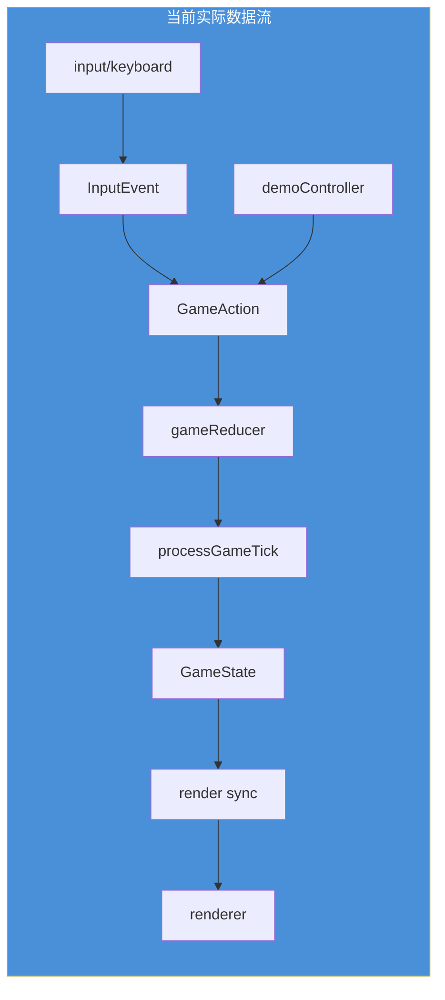
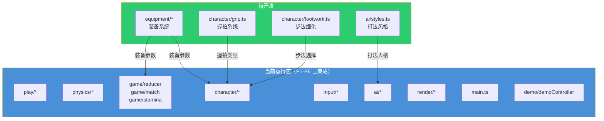
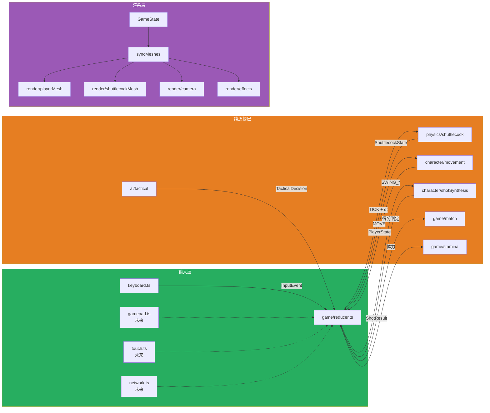
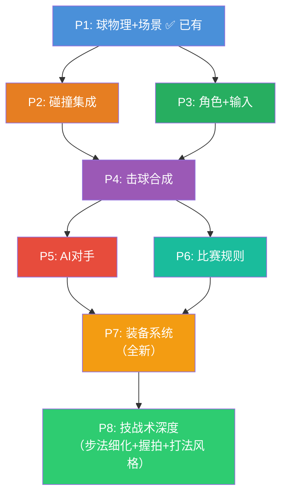

# badminton-web 架构

> 本文档分两层：**当前现状**（真实运行的代码）和 **规划蓝图**（已设计/实现但尚未接入的模块）。
> 设计理念见 [design.md](design.md)。

---

## 当前现状

当前运行态已经从 Phase 1 的直筒原型切到 reducer 驱动，并新增了一个很薄的 `play/` 浏览器编排层。`main.ts` 现在只负责入口调用，运行时编排由 `play/start.ts` 和 `play/frame.ts` 承担。

### 运行态模块依赖图

```mermaid
graph TD
    subgraph Runtime["当前运行态"]
        MAIN[main.ts<br/>@entry] --> START[play/start.ts]
        START --> INPUT[input/keyboard.ts]
        START --> HOTKEYS[play/hotkeys.ts]
        START --> HUD[render/hud.ts]
        START --> DEMO[demo/demoController.ts]
        START --> REC[recording/recorder.ts]
        START --> FRAME[play/frame.ts]
        FRAME --> REDUCER[game/reducer.ts]
        INPUT --> REDUCER
        DEMO --> REDUCER
        REDUCER --> TICK[game/tickService.ts]
        TICK --> PHY[physics/*]
        TICK --> CHAR[character/*]
        TICK --> AI[ai/*]
        TICK --> MATCH[game/match.ts]
        TICK --> STAMINA[game/stamina.ts]
    end

    subgraph Three["Three.js 依赖"]
        three[three]
    end

    RENDER -.-> three
    MAIN -.-> three

    style Runtime fill:#4a90d9,color:#fff
    style Three fill:#333,color:#aaa
```

### 模块接口（现状）

#### `physics/shuttlecock.ts`

```typescript
type ShuttlecockState = { pos, vel, spin: [3]number }
type ShuttlecockConfig = { mass, crossSection, magnusCoef: number }

function stepShuttlecock(state, dt, cfg?, subSteps?): ShuttlecockState
function launchShuttlecock(origin, speed, angleDeg, headingDeg, spin?): ShuttlecockState
```

✅ **已测试**：`shuttlecock.test.ts` 包含数值稳定性测试。

#### `game/types.ts` + `game/reducer.ts`

```typescript
type GamePhase = 'idle' | 'playing' | 'paused' | 'point_scored' | 'set_end' | 'match_end'
type GameAction =
  | PlayerGameAction
  | { type: 'TICK'; dt: number; aiConfigs?: TickAIConfigs }
  | { type: 'POINT_DELAY_ELAPSED' }
  | { type: 'RESOLVE_SET_END' }
  | { type: 'RESTART_MATCH'; players: GameState['players'] }

function createFullGameState(): GameState
function gameReducer(state, action): GameState
```

**当前实现**：所有 `GameState` 变更统一经过 reducer；比赛结算、回合延时和重开比赛也都通过显式 action 进入。

#### `game/tickService.ts`

```typescript
function processGameTick(state, dt, aiConfigs?): GameState
```

负责一帧内的物理步进、碰撞检测、击球合成和计分判定。

人类挥拍输入由 `character/stroke.ts` 保留为 `queued`，`processGameTick` 在来球到达时启动挥拍，
并通过现有 `updateMovement` 完成附近站位调整。`character/interception.ts` 的纯轨迹预测同时由
击球循环和 `play/frame.ts` 使用；画面上的预测每 80ms 更新，只保存在场景视图中。
AI 继续使用现有战术计划和直接出拍时机，所有比赛状态变化仍经 `gameReducer`。

#### `render/camera.ts`

```typescript
function createGameCamera(): THREE.PerspectiveCamera
function updateCamera(camera, target: THREE.Vector3): void
```

← **已从 `game/` 移入**，消除分层违规。

#### `render/court.ts`

```typescript
function createCourt(scene: THREE.Scene): void    // 球场 mesh + 网 + 支柱
```

#### `render/shuttlecockMesh.ts`

```typescript
function createShuttlecockMesh(): THREE.Group      // 球头(半球) + 裙(锥体)
```

#### `input/keyboard.ts`

```typescript
type KeyMapping = { moveUp, moveDown, moveLeft, moveRight, serve, swing, pause: string }
function createKeyboardAdapter(playerIndex?, keymap?): InputAdapter
```

当前实现：WASD 方向轮询 + keydown/keyup 立即同步，主循环通过 `InputEvent -> GameAction` 接入 reducer。

#### `demo/demoController.ts`

```typescript
function getActions(state): GameAction[]
function getAIConfigs(): { home: AIConfig; away: AIConfig }
```

当前实现：演示模式只负责生成 AI MOVE/STOP_MOVE 动作，不直接改状态。

#### `play/start.ts`

负责：场景组装 → HUD/录像 bootstrap → 输入适配器连接 → 动画循环安装。

#### `play/frame.ts`

负责：单帧逻辑推进（计时、自动发球、回合延时、AI MOVE、tick、render sync）。

#### `render/hud.ts`

负责：3D 计分牌、状态板和 DOM overlay 的创建与更新。

#### `main.ts` — 入口

@entry 只负责调用 `startGame()`。

---

### 现状数据流



**关键观察**：运行态已经收敛到单向数据流；当前剩余债务主要是 `play/start.ts` 仍同时拥有 scene bootstrap、录像和浏览器事件安装。

### 已知架构债务

| # | 问题 | 位置 | 影响 |
|---|------|------|------|
| 1 | `play/start.ts` 仍同时拥有场景 bootstrap、录像和浏览器事件安装 | `play/start.ts` | 编排层继续扩展时仍可能膨胀 |
| 2 | 发球参数仍硬编码在 reducer | `game/reducer.ts` | 击球系统继续深化时需要抽到规则/配置层 |
| 3 | 录像/HUD 计时器仍是运行时局部状态 | `play/viewState.ts` | 无法参与回放或纯逻辑测试 |

---

## 规划蓝图（Phase 7 → 8）

以下模块**已规划但尚未实现**，按 Phase 顺序开发。

### 总览



### 模块接口（近期集成）

#### `input/types.ts` — 输入抽象

```typescript
type InputAction =
  | { type: 'SERVE' }
  | { type: 'MOVE'; dir: MoveDirection }
  | { type: 'STOP_MOVE' }
  | { type: 'SWING_START' }
  | { type: 'SWING_RELEASE' }
  | { type: 'PAUSE' }
  | { type: 'RESET' }

type InputSource = 'keyboard' | 'gamepad' | 'touch'
interface InputEvent { action, source, timestamp, playerIndex }
interface InputAdapter { connect(listener): void; disconnect(): void }
```

✅ 纯 JSON 可序列化。

#### `input/keyboard.ts` — 键盘适配器

```typescript
type KeyMapping = { moveUp, moveDown, moveLeft, moveRight, serve, swing, pause: string }
function createKeyboardAdapter(playerIndex?, keymap?): InputAdapter
```

✅ 含轮询循环（60fps MOVE 事件）、WASD 方向归一化、SWING 蓄力/释放。

#### `character/types.ts` — 角色状态

```typescript
type Gait = 'idle' | 'walk' | 'sprint'
type MovementState = { targetDir, currentVel, gait, readiness: number }
type PlayerState = {
  pos: [3]number; facing: number; movement: MovementState
  racket: RacketState; stamina: number; maxStamina: number
  wantsToSwing: boolean; side: 0 | 1
}
```

#### `character/movement.ts` — 步法惯性系统

```typescript
type MovementConfig = { maxSpeed, acceleration, deceleration, turnPenalty, sprintThreshold }
function updateMovement(player, dt, cfg?): PlayerState
```

✅ 加速度/减速度模型、急转惩罚（角度 > 45° 减速）、到位度计算。已由 `game/reducer.ts` 经 `TICK` 主循环调用。

#### `character/shotSynthesis.ts` — 击球合成

```typescript
type ShotType = 'SMASH' | 'DROP' | 'CLEAR' | 'DRIVE' | 'NET_DROP' | 'LIFT'
type ShotIntent = { type, power, target, spin? }
type ShotResult = { type, collision: CollisionResult, timing: TimingWindow, staminaCost }

function getAvailableShots(player, shuttle): AvailableShot[]
function synthesizeShot(intent, player, shuttle, timing): ShotResult
```

✅ 6 种球路 + 高度/距离条件判定 + 质量倍率调节。

#### `ai/types.ts` — AI 决策类型

```typescript
type AIDifficulty = 'easy' | 'medium' | 'hard'
type AIConfig = { difficulty, reactionDelay, accuracy, aggressiveness, errorRate }
type TacticalDecision = { moveTarget, shotType, power, target, risk }
```

✅ 三档预设（easy/medium/hard）、难度参数差异化。

#### `ai/tactical.ts` — AI 战术选择

```typescript
function decideTactical(aiPlayer, opponent, shuttle, config): TacticalDecision
```

✅ 是否到位的判定 → 选球路 → 选落点 → 选力量，含随机扰动。

#### `ai/difficulty.ts` — 难度参数调节

```typescript
function applyDifficulty(decision, config): TacticalDecision   // 注入失误/延时
```

#### `game/types.ts` — 扩展游戏状态

```typescript
type GamePhase = 'idle' | 'playing' | 'point_scored' | 'set_end' | 'match_end'
type MatchState = { server, currentSet, sets, points, isDeuce, serviceSide }
type GameState = {
  phase: GamePhase
  shuttle: ShuttlecockState | null
  players: [PlayerState | null, PlayerState | null]
  match: MatchState | null
  currentPlayer: 0 | 1
  elapsed: number
}
```

#### `game/reducer.ts` — 集中归约器

```typescript
type GameAction = InputAction | { type: 'TICK'; dt: number } | { type: 'RESET' } | { type: 'SET_PLAYERS' }
function gameReducer(state: GameState, action: GameAction): GameState
```

✅ **唯一状态变更入口**。处理 SERVE/MOVE/STOP_MOVE/TICK/RESET。TICK 内调用 `updateMovement`。**尚未被 main.ts 使用**。

#### `game/match.ts` — BWF 计分规则

```typescript
function checkPoint(state: GameState): GameState       // 得分判定
function handleSetEnd(match: MatchState): MatchState    // 局结算
```

✅ 三局两胜 21 分制、deuce（先到 30 分封顶）、发球权切换。

#### `game/stamina.ts` — 体力系统

```typescript
function updateStamina(player, dt, cfg?): PlayerState   // sprint 消耗 / idle 回复
function getSpeedMultiplier(stamina, cfg?): number      // 疲劳减速
```

#### `render/playerMesh.ts` — 球员几何体

```typescript
function createPlayerMesh(colors?): THREE.Group
function updatePlayerMesh(group, pos, facing): void
```

✅ 躯干+头+拍杆+拍框，极简几何体。

#### `render/effects.ts` — 视觉特效

```typescript
function spawnImpactEffect(pos, intensity?): ImpactEffect
function updateEffects(now, scene): void
```

✅ 击球反馈特效占位（当前为生命周期管理）。

---

## 分层原则

| 层级 | 目录 | Three.js 依赖 | 可独立测试 | 状态 |
|------|------|:---:|:---:|:---:|
| 纯数学 | `physics/` | ❌ | ✅ | ✅ 已有 |
| 状态归约 | `game/` | ❌ | ✅ | 🔶 部分已有（旧/新共存） |
| 角色控制 | `character/` | ❌ | ✅ | ✅ 已实现，待集成 |
| AI 决策 | `ai/` | ❌ | ✅ | ✅ 已实现，待集成 |
| 输入抽象 | `input/` | ❌ | ✅ | ✅ 已实现，待集成 |
| 渲染 | `render/` | ✅ | ❌ | ✅ 已有 |
| 编排 | `main.ts` | ✅ | ❌ | 🔶 待重构 |

## 目标数据流（规划）



### 每帧循环（规划）

```
1. inputAdapter 收集输入 → InputEvent
2. gameReducer(state, nonTICK action) 处理即时动作（SERVE/SWING_START 等）
3. gameReducer(state, TICK{dt}) → 统一步进：
   a. 物理步进（shuttlecock）
   b. 角色移动更新（movement）
   c. 碰撞检测（racket）[P2]
   d. 落地/出界/过网判定 [P4]
   e. 体力消耗 [P6]
4. syncMeshes(state)：mesh.position = logic.pos
5. renderer.render()
```

---


## Phase 实施路线



| Phase | 依赖 | 集成内容 | 关键动作 |
|-------|------|---------|---------|
| **P1** | — | physics/shuttlecock, render/*, game/reducer + game/types, play/start | ✅ 已完成 |
| **P2** | P1 | physics/racket 接入 game loop | ✅ 已集成 |
| **P3** | P1 | input/*, character/movement, render/playerMesh | ✅ 已集成 |
| **P4** | P2+P3 | shotSynthesis, contact, shotTargeting | ✅ 已集成 |
| **P5** | P3+P4 | ai/* | ✅ 已集成 |
| **P6** | P4 | match, stamina | ✅ 已集成 |
| **P7** | P5+P6 | equipment/* | 装备参数系统，影响物理和击球合成 |
| **P8** | P7 | character/grip, character/footwork, ai/styles | 握拍/步法细化 + 打法风格 |

> 详细技术决策见 [ADR 记录](adr/)。
